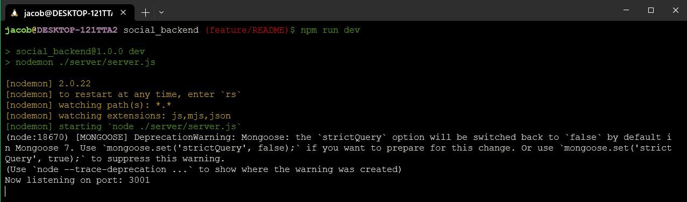
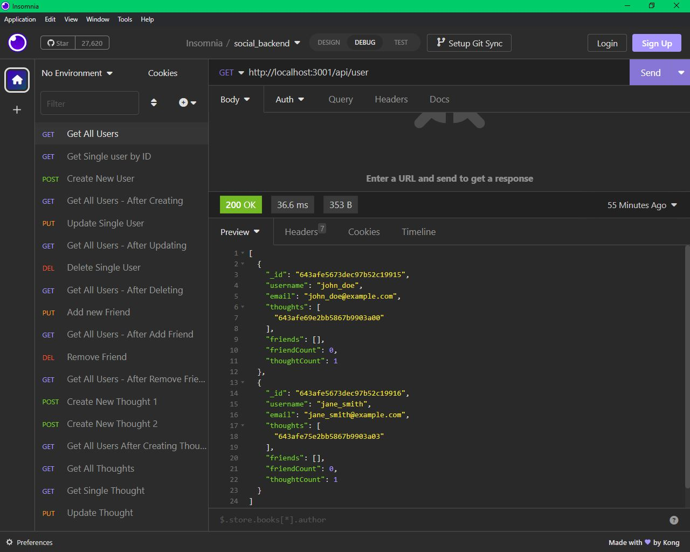

# Social Media App Backend Created with Mongo DB
MSU Bootcamp module 18 Challenge

##
This backend server facilitates a social media page using MongoDB and mongoose. You can have full CRUD routes for users, and their thoughts. Furthermore, users are able to posts reactions to thoughts of their own or other users. 

This application does not have a frontend, but can be used with Insomnia or Postman. Demonstration of this application is done using Insomnia & WSL:1 using Ubuntu 22.04. 

https://insomnia.rest/

https://www.postman.com/

Prior to using this application you must have MongoDB installed. Please see their documentation here: https://www.mongodb.com/docs/manual/installation/





## Installation

1. Start by cloning the Git Repository: https://github.com/Jacob-Jeffries/social_backend
```
$ git clone git@github.com:Jacob-Jeffries/social_backend.git
```
2. Navigate to the working directory of the local repo.
```
$ cd social_backend
```
3. Initialize node packages
```
$ npm i
```
4. Seed your MongoDB (the seed data gives a couple users, nothing else)
```
$ npm run seed
```
5. Start the express server
```
$ npm run dev
```
## Usage

Prior to using this application, MongoDB and either Insomnia or Postman must be installed, please follow relevant documentation at the links above. 

1. Once the application is cloned, initialized, seeded, and the server has been started - Open Insomnia
2. The server is running on http://localhost:3001
3. There are a myriad of route options:
    1. User Routes:
        1. GET - /api/user - get all users
        2. GET - /api/user/:id - get single user by id
        3. POST - /api/user - create new user using JSON Body
        4. PUT - /api/user/:id - update singe user by id using JSON body
        5. DELETE - /api/user/:id - delete single user by id
        6. PUT = /api/user/:userId/friends/:friendId - add a new friend to a user by using user id and a friend's user id
        7. Delete - /api/user/:userId/friends/:friendId - delete a friend from a user by using the user id and the friend's user id
    2. Thought Routes:
        1. GET - /api/thought - get all thoughts from the DB
        2. GET - /api/thought/:id - get a single thought by its id
        3. POST - /api/thought - create a new thought using JSON body
        4. PUT - /api/thought/:id - update a single post by its id using a JSON body
        5. DELETE - /api/thought/:id - delete a single thought by its id
        6. POST - /api/thought/:thoughtId/reactions - create a new reaction to a thought by its id using a JSON body
        7. DELETE - /api/thought/:thoughtId/reactions/:reactionId - delete a specific reaction to a specific thought using both of their id's
4. Please watch the video below for examples of each of these routes

https://www.youtube.com/watch?v=2wyDIM760jE

## Credits

Coded independently by Jacob Jeffries

### Packages and Software Used:
* WSL 1 (Windows Subsystem for Linux: Ubuntu 22.04.2 LTS)
* MongoDB v6.0.4 Community
* MongoDB Compass v1.36.3
* VScode v 1.77.3
* Node.js v18.13.0
* npm v8.19.3
* express v4.18.2
* mongoose v6.9.2
* eslint v8.38.0
* eslint-config-semistandard v17.0.0
* eslint-config-standard v17.0.0
* eslint-plugin-import v2.27.5
* eslint-plugin-n v15.7.0
* eslint-plugin-promise v6.1.1
* nodemon v2.0.22
* Insomnia v2023.1.0

## License

MIT License

Copyright (c) [2023] [Jacob Jeffries]

Permission is hereby granted, free of charge, to any person obtaining a copy
of this software and associated documentation files (the "Software"), to deal
in the Software without restriction, including without limitation the rights
to use, copy, modify, merge, publish, distribute, sublicense, and/or sell
copies of the Software, and to permit persons to whom the Software is
furnished to do so, subject to the following conditions:

The above copyright notice and this permission notice shall be included in all
copies or substantial portions of the Software.

THE SOFTWARE IS PROVIDED "AS IS", WITHOUT WARRANTY OF ANY KIND, EXPRESS OR
IMPLIED, INCLUDING BUT NOT LIMITED TO THE WARRANTIES OF MERCHANTABILITY,
FITNESS FOR A PARTICULAR PURPOSE AND NONINFRINGEMENT. IN NO EVENT SHALL THE
AUTHORS OR COPYRIGHT HOLDERS BE LIABLE FOR ANY CLAIM, DAMAGES OR OTHER
LIABILITY, WHETHER IN AN ACTION OF CONTRACT, TORT OR OTHERWISE, ARISING FROM,
OUT OF OR IN CONNECTION WITH THE SOFTWARE OR THE USE OR OTHER DEALINGS IN THE
SOFTWARE.
